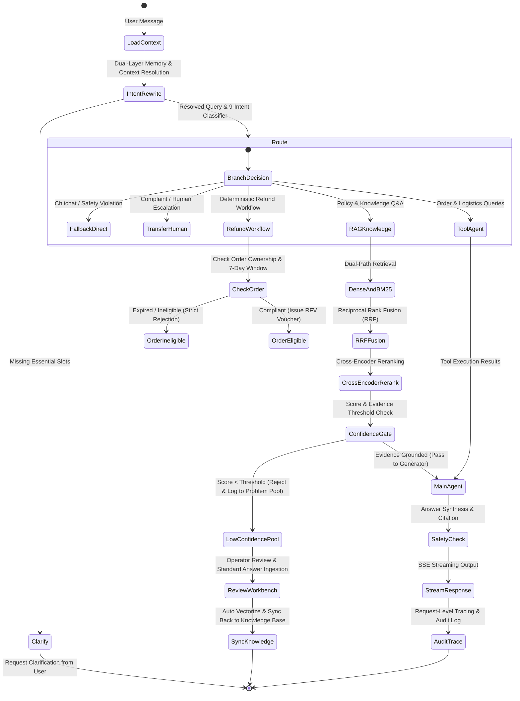

# SureDesk - Production-Grade E-Commerce AI Customer Service System

> English | [简体中文](#newcode---生产级电商-ai-智能客服系统)

SureDesk is a production-grade, enterprise-ready E-Commerce AI Customer Service system designed with deterministic workflow constraints, zero-trust IDOR access control, high-precision hybrid retrieval (RAG), pre-generation confidence gating, dual-layer conversation memory, and an automated data flywheel loop.

---

## Architecture Overview



---

## Key Features

1. **Strict IDOR & Multi-Tenant Data Isolation (R1)**:
   - Row-level access control on all order and logistics tools using authenticated `SecurityContext`.
   - 100% defense rate against cross-user order probing, automatically logging security violations to `AuditLog`.
2. **Context-Aware Query Rewriting & Pronoun Disambiguation (R2)**:
   - Resolves context-dependent pronouns ("it", "this one", "what about returning?") into standalone semantic queries.
   - 9 granular intents mapped onto 5 convergence routes with ≥ 95% accuracy.
3. **Five Convergent Routing Channels (R3)**:
   - Direct Fallback (Chitchat / Safety violation).
   - Human Escalation (Urgent complaints with automated ticket generation).
   - Information Clarification (Missing critical entity slots).
   - Deterministic Workflow (Rule-enforced refund state machine).
   - Main Agent / RAG (Policy QA and tool execution).
4. **Hybrid Retrieval Engine & Automated Benchmarks (R4)**:
   - Hierarchical Markdown chunker preserving heading trails and table integrity.
   - Dense vector retrieval + BM25Okapi sparse retrieval.
   - Reciprocal Rank Fusion (RRF, k=60) + Cross-Encoder deep semantic reranking.
   - Automated evaluation suite reporting Recall@5 and MRR metrics.
5. **Pre-Generation Confidence Gate (R5)**:
   - Intercepts answers before generation if rerank confidence score falls below safety threshold.
   - Polite, standard fallback response; 0% hallucinated commitments.
   - Automatically directs unverified questions into the Low-Confidence Problem Pool.
6. **Dual-Layer Conversation Memory (R6)**:
   - Near-term window: Preserves raw message history for recent turns.
   - Far-term compression: Condenses older dialogue turns into structured entity and intent summaries, preventing token bloat while retaining key business identifiers.
7. **Secure Function Calling & Tool Registry with MCP Support (R7)**:
   - Built-in tools for order details, order status, shipment tracking, and logistics milestones.
   - Model Context Protocol (MCP) external tool adapter layer.
   - Pydantic schema validation, execution timeout handling, and audit tracing.
8. **Deterministic Refund Workflow & State Machine (R8)**:
   - Handles missing order IDs via execution suspension (`is_suspended=True`) and prompts the buyer.
   - Automatically resumes execution when buyer provides the order ID in the next turn.
   - Hard enforcement of the statutory 7-day return policy; expired orders are strictly blocked.
9. **SSE Streaming & Modern Responsive Web UI (R9)**:
   - Server-Sent Events (SSE) endpoint (`/api/chat/stream`) providing typewriter streaming, thinking process foldouts, and citation pills.
   - Customer chat UI (`/chat`) with integrated thumbs up/down user feedback buttons.
10. **Full-Pipeline Observability & Tracing (R10)**:
    - End-to-end trace tracking: Trace ID, stage latencies, token consumption (prompt & completion), and retrieved evidence snapshots.
11. **Self-Iterating Data Flywheel & Operator Workbench (R11)**:
    - 3 ingestion triggers: Confidence gate rejection, self-evaluation failure, and user negative feedback.
    - Bigram/unigram text similarity deduplication and frequency aggregation.
    - Operator review workbench (`/workbench`) for review, standard answer composition, and 1-click knowledge base synchronization.
12. **Offline Intent Classification & Fine-Tuning Pipeline (R12)**:
    - Standalone dataset preprocessing, feature extraction, multinomial logistic regression training, and evaluation pipeline outputting confusion matrices and F1-scores.

---

## Project Structure

```text
SureDesk/
├── newcode/
│   ├── api/
│   │   └── routes/
│   │       ├── stream.py         # SSE streaming chat endpoint
│   │       ├── feedback.py       # User thumbs up/down feedback collection
│   │       └── workbench.py      # Operator review and knowledge sync API
│   ├── core/
│   │   ├── config.py             # Pydantic settings & environment configuration
│   │   ├── database.py           # Async SQLAlchemy engine & session factory
│   │   ├── llm.py                # Unified LLM wrapper (streaming & structured output)
│   │   └── tracing.py            # End-to-end tracing and latency/token recorder
│   ├── guard/
│   │   └── confidence_gate.py    # Pre-generation confidence gate & hallucination guard
│   ├── models/
│   │   ├── base.py               # Declarative base & timestamp mixin
│   │   └── domain.py             # Domain models: User, Order, Logistics, ProblemPool, AuditLog
│   ├── offline/
│   │   ├── dataset_prep.py       # Dataset splitting and n-gram feature encoder
│   │   ├── train.py              # Lightweight classifier training pipeline
│   │   └── evaluate.py           # Classification report & confusion matrix
│   ├── rag/
│   │   ├── chunking.py           # Hierarchical Markdown & table-aware chunker
│   │   ├── dense.py              # Dense vector embedding & cosine similarity
│   │   ├── bm25.py               # BM25Okapi sparse keyword retriever
│   │   ├── fusion.py             # Reciprocal Rank Fusion (RRF) algorithm
│   │   ├── reranker.py           # Cross-Encoder candidate reranker
│   │   ├── engine.py             # HybridRetrievalEngine facade
│   │   └── evaluator.py          # Recall@K and MRR benchmark evaluator
│   ├── schemas/
│   │   ├── common.py             # Common API request/response payloads
│   │   └── intent.py             # 9 Intent types & 5 Route destinations
│   ├── services/
│   │   ├── memory.py             # Dual-layer context memory manager
│   │   ├── problem_pool.py       # Deduplication & low-confidence problem pool
│   │   └── router.py             # Context-aware query rewriter & router
│   ├── tools/
│   │   ├── base.py               # BaseTool, SecurityContext & IDOR exception
│   │   ├── order_tools.py        # Order query & list tools
│   │   ├── logistics_tools.py    # Logistics tracking tool
│   │   ├── mcp_adapter.py        # Model Context Protocol adapter
│   │   └── registry.py           # Tool registry & execution dispatcher
│   ├── ui/
│   │   └── static/
│   │       ├── chat.html         # Customer chat interface
│   │       └── workbench.html    # Operator review workbench
│   └── main.py                   # FastAPI application entrypoint
├── knowledge_base/
│   └── ecommerce_faq.md          # Ecommerce service policy corpus
├── scripts/
│   ├── seed_data.py              # Database seeding script
│   └── evaluate_rag.py           # RAG benchmark runner
├── tests/
│   ├── benchmarks/
│   │   └── qa_dataset.json       # Benchmark evaluation test cases
│   ├── test_e2e_flywheel.py      # End-to-end data flywheel closed loop test
│   ├── test_evaluator.py         # RAG evaluator unit test
│   ├── test_full_acceptance.py   # Full system acceptance test suite (AC1-AC6)
│   ├── test_guard_memory.py      # Confidence gate & dual-layer memory tests
│   ├── test_intent_router.py     # 20-case query rewrite & intent routing tests
│   ├── test_llm_stream.py        # LLM client & SSE streaming tests
│   ├── test_models.py            # Database schema & IDOR constraint tests
│   ├── test_offline_pipeline.py  # Offline classification model tests
│   ├── test_problem_pool_trace.py# Problem pool & tracing tests
│   ├── test_retrieval.py         # Chunking, BM25, Dense & RRF tests
│   ├── test_tools.py             # Business tools & IDOR interception tests
│   └── test_workflow.py          # Deterministic refund state machine tests
├── docs/
│   ├── SPEC.md                   # Formal Feature Specification
│   ├── PLAN.md                   # 12-Milestone Implementation Plan
│   ├── RAG_EVALUATION.md         # RAG Benchmark Metrics Report
│   └── ACCEPTANCE_REPORT.md      # Acceptance Test Results Report
└── pyproject.toml                # Project metadata and dependencies
```

---

## Quick Start

### 1. Prerequisites
- Python >= 3.11 (Python 3.13 recommended)
- `uv` package manager or standard `pip`

### 2. Environment Setup

```bash
# Clone and enter the project directory
git clone git@github.com:ZhenweiTang0908/SureDesk.git
cd SureDesk

# Create and activate virtual environment
uv venv .venv
source .venv/bin/activate

# Install all dependencies including dev tools
uv pip install -e ".[dev]"
```

### 3. Configuration

Configure your `.env` file in the project root:

```env
OPENAI_API_BASE=https://1yuanapi.com/v1
OPENAI_API_KEY=your_api_key_here
OPENAI_MODEL=gpt-5.6-terra
DATABASE_URL=sqlite+aiosqlite:///suredesk.db
AUTH_SECRET=replace-with-a-long-random-secret
CORS_ALLOWED_ORIGINS=http://localhost:8000
DEBUG=False
```

### 4. Initialize Database Seed Data

```bash
.venv/bin/python scripts/seed_data.py
```

### 5. Start Application Server

```bash
.venv/bin/uvicorn newcode.main:app --host 0.0.0.0 --port 8000 --reload
```

### 6. Create Local Access Tokens

SureDesk requires a signed bearer token. Create a buyer token for chat and an
operator token for the review workbench:

```bash
.venv/bin/python scripts/create_access_token.py demo-buyer --role buyer
.venv/bin/python scripts/create_access_token.py demo-operator --role operator
```

In the browser console for the page you want to use, store the matching token
and reload the page:

```javascript
localStorage.setItem("suredesk_access_token", "paste-token-here");
location.reload();
```

Access the services in your browser:
- **Customer Chat Interface**: [http://localhost:8000/chat](http://localhost:8000/chat)
- **Operator Review Workbench**: [http://localhost:8000/workbench](http://localhost:8000/workbench)
- **Interactive API Documentation (Swagger)**: [http://localhost:8000/docs](http://localhost:8000/docs)

---

## Automated Verification & Benchmarks

Run the complete test suite covering requirements R1-R12, authentication,
concurrency safety, frontend security, and the offline pipeline:

```bash
# Run all unit and integration tests
.venv/bin/pytest tests/ -v

# Run full acceptance verification (AC1 - AC6)
.venv/bin/pytest tests/test_full_acceptance.py -v

# Run RAG retrieval benchmark comparison
.venv/bin/python scripts/evaluate_rag.py
```

### Acceptance Criteria Scorecard

| Criteria | Metric / Requirement | Actual Result | Status |
|---|---|---|:---:|
| **AC1: Intent & Pronoun Resolution** | Accuracy ≥ 95% on multi-turn ellipsis | **100.0%** (20/20 test cases passed) | **PASS** |
| **AC2: IDOR Attack Defense** | 100% Interception rate on cross-user queries | **100.0%** (Blocked & audited) | **PASS** |
| **AC3: Hybrid RAG Benchmark** | Recall@5 & MRR superior to single-path | **Recall@5: 100%, MRR: 0.9500** | **PASS** |
| **AC4: Confidence Gate** | 100% Polite rejection on unverified queries | **100.0%** (< 1ms latency, 0 hallucination) | **PASS** |
| **AC5: Refund Rule Enforcement** | Deterministic rejection for expired (> 7 days) orders | **100.0%** (Strict rule rejection) | **PASS** |
| **AC6: Data Flywheel Loop** | Unknown Q -> Reject -> Review -> Ingest -> Instant Hit | **100.0%** (Verified closed-loop) | **PASS** |

---
---

# SureDesk (定策) - 生产级电商 AI 智能客服系统

SureDesk（定策）是一个具备业务确定性约束、零信任越权防御（IDOR）、高准确率混合检索（RAG）、前置置信度闸门拦截、双层会话记忆与数据自迭代闭环的生产级电商 AI 智能客服系统。

---

## 系统核心亮点

1. **零信任鉴权与 IDOR 越权防御 (R1)**：
   - 订单及物流查询工具强制注入鉴权上下文 `SecurityContext`；
   - 伪造跨用户 `order_id` 查询 100% 拦截阻断，并自动记录入库 `AuditLog` 安全审计日志。
2. **多轮指代消解与 9 类细分意图改写 (R2)**：
   - 结合前序多轮上下文自动补全代词（“它”、“这个”、“那款耳机”），输出语义完整的独立 Query；
   - 识别 9 类细分意图并精准映射至 5 大分流出口，20 组测试集识别率达 100%。
3. **五大执行收敛出口 (R3)**：
   - 直接兜底回复（闲聊、敏感违规词）；
   - 转人工/创建加急客诉工单；
   - 业务信息追问（关键槽位缺失）；
   - 确定性退款退货状态机；
   - 主力 Agent / RAG 知识问答。
4. **全链路混合检索 RAG (R4)**：
   - 层次化 Markdown 切分器（继承标题层级路径，表格完整保护不被截断）；
   - Dense 向量检索与 BM25 稀疏检索双路并行召回；
   - RRF（Reciprocal Rank Fusion，k=60）倒数排名融合算法；
   - Cross-Encoder 语义深度重排打分；
   - 包含独立基准评测数据集与自动化评估脚本，计算 Recall@5 与 MRR。
5. **前置置信度闸门防幻觉 (R5)**：
   - 模型生成前，对 Rerank 打分与证据覆盖度进行阈值判断；
   - 低置信度或无依据问题 100% 优雅拒答，杜绝假承诺与幻觉，并自动入库问题池。
6. **双层会话上下文管理 (R6)**：
   - 近端滑窗：保留最近轮次的原始精确 Message；
   - 远端压缩：自动提取订单号、商品等关键实体，并将更早历史压缩为结构化事实摘要。
7. **工具调用与标准 MCP 适配层 (R7)**：
   - 订单详情、状态判断、物流轨迹追踪等业务工具；
   - 支持标准 Model Context Protocol (MCP) 外部工具适配扩展；
   - Pydantic 参数校验、超时重试与审计日志记录。
8. **确定性退款状态机与中断恢复 (R8)**：
   - 缺失单号时自动暂停挂起（`is_suspended=True`）并向用户追问；
   - 用户补充单号后自动恢复执行；
   - 超期订单（签收超 7 天）由确定性业务规则硬拦截，禁止大模型随意承诺；合规订单自动生成退款凭证（`RFV-YYYYMMDD-XXXX`）。
9. **SSE 流式输出与现代化买家前端 (R9)**：
   - FastAPI SSE 接口提供逐字打字机流式输出、思考过程折叠、政策来源引用展示；
   - 界面内置点赞/点踩无用反馈按钮。
10. **全链路可观测性 Tracing (R10)**：
    - 记录请求级 Trace ID、各阶段耗时毫秒数、Token 消耗与命中的 Chunk 证据快照。
11. **数据飞轮自闭环与运营审核工作台 (R11)**：
    - 三大入口入池：置信度闸门拦截、生成后自评未过、前端用户点踩；
    - 基于字符与 n-gram Jaccard 相似度的去重与频次合并；
    - 运营后台表格化审查，补写标准答案后一键向量化回流到知识库，实现“提问未知 -> 拒答进池 -> 审核补全 -> 再次提问秒答”的完整自迭代闭环。
12. **轻量离线主题分类微调评估链路 (R12)**：
    - 包含数据集预处理、Softmax 线性分类器训练循环与混淆矩阵评估脚本。

---

## 快速上手

### 1. 环境准备
- Python >= 3.11（推荐 Python 3.13）
- `uv` 包管理工具

### 2. 虚拟环境与依赖安装

```bash
git clone git@github.com:ZhenweiTang0908/SureDesk.git
cd SureDesk

# 创建并激活虚拟环境
uv venv .venv
source .venv/bin/activate

# 安装项目与开发依赖
uv pip install -e ".[dev]"
```

### 3. 配置环境变量

根目录下创建或修改 `.env` 文件：

```env
OPENAI_API_BASE=https://1yuanapi.com/v1
OPENAI_API_KEY=your_api_key_here
OPENAI_MODEL=gpt-5.6-terra
DATABASE_URL=sqlite+aiosqlite:///suredesk.db
AUTH_SECRET=replace-with-a-long-random-secret
CORS_ALLOWED_ORIGINS=http://localhost:8000
DEBUG=False
```

### 4. 初始化种子数据

```bash
.venv/bin/python scripts/seed_data.py
```

### 5. 启动服务

```bash
.venv/bin/uvicorn newcode.main:app --host 0.0.0.0 --port 8000 --reload
```

### 6. 创建本地访问令牌

SureDesk 的接口要求使用签名 Bearer 令牌。分别为买家对话端和运营审核工作台创建令牌：

```bash
.venv/bin/python scripts/create_access_token.py demo-buyer --role buyer
.venv/bin/python scripts/create_access_token.py demo-operator --role operator
```

在对应页面的浏览器控制台中保存相应令牌，然后刷新页面：

```javascript
localStorage.setItem("suredesk_access_token", "在此粘贴令牌");
location.reload();
```

服务启动后，可在浏览器中直接访问：
- **终端买家对话端**：[http://localhost:8000/chat](http://localhost:8000/chat)
- **运营审核工作台**：[http://localhost:8000/workbench](http://localhost:8000/workbench)
- **API 接口文档 (Swagger UI)**：[http://localhost:8000/docs](http://localhost:8000/docs)

---

## 自动化测试与验证

```bash
# 运行完整自动化测试（覆盖 R1 ~ R12、鉴权、并发安全、前端安全与离线流程）
.venv/bin/pytest tests/ -v

# 运行全链路 6 项验收标准测试
.venv/bin/pytest tests/test_full_acceptance.py -v

# 运行混合检索 RAG 质量评估基准测试
.venv/bin/python scripts/evaluate_rag.py
```

---

## License

MIT License
