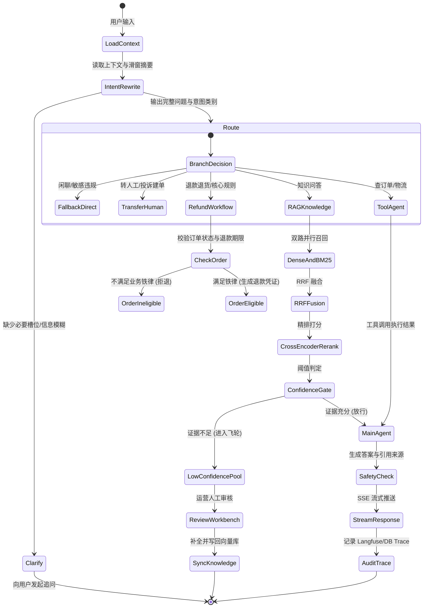

我已详细阅读并解析了文章原文以及其中包含的全部关键架构图、业务全流程泳道图、分层架构图、数据飞轮流转图、12章实战大纲与高频设计追问图。

这里严格按照 [`$brief-to-spec`](/Users/niuniutang/Documents/ChatGPT/TZW-skills/lightweight-developments/.agents/skills/brief-to-spec/SKILL.md) 规范，先将整个系统提炼为正式的**功能规格说明（Feature Spec）**，并在此基础上为你拟定**模块拆解与单 Commit 递进实现计划**。

---

# 电商 AI 智能客服系统（MewHelp）功能规格说明书 (Spec)

## 1. 目标与范围 (Goal and Scope)

### 1.1 业务目标
构建一个具备业务确定性约束、高准确率检索、安全可控工具调用、双层会话记忆、置信度拒答与数据自迭代闭环的生产级电商 AI 智能客服系统。

### 1.2 核心用户角色
- **终端买家（User）**：通过 Web 页面进行自然语言多轮问答、订单/物流查询、退换货申请，获得流式（SSE）响应。
- **运营/审核员（Operator）**：在后台工作台审核低置信度问题、查重合并、修正答案并一键回流知识库。
- **运维/工程师（Engineer）**：查看 Langfuse 链路追踪（Trace Tree）、Token 消耗、各节点耗时、检索命中证据。

---

## 2. 功能需求列表 (Requirements)

- **R1（接入与鉴权隔离）**：支持传入 `user_id` 与 `session_id`。所有订单、退款、物流查询必须强校验 `user_id` 归属，杜绝越权查询（IDOR）。
- **R2（指代消解与意图识别 Query 改写）**：对多轮半截话（如“那它能退吗”）结合前序上下文进行指代消解和补全，输出独立语义完整的问题；识别 9 类细分意图（商品咨询、售前规则、订单查询、物流进度、退款申请、投诉/转人工、闲聊、敏感违规、未决追问）。
- **R3（路由与五大分流出口）**：将 9 类意图收敛到 5 个执行出口：
  1. 直接兜底回复（闲聊、敏感违规）
  2. 转人工 / 建工单
  3. 业务信息追问（关键要素缺失）
  4. 确定性 Workflow 子流程（退款/退货等强规则操作，中途缺单号可暂停并等待用户补齐）
  5. 主力 Agent / RAG 知识检索问答
- **R4（全链路混合检索 RAG 与重排）**：
  - 文档按层级标题与表格规则切分；
  - 稠密向量（Dense Embedding，如 BGE-M3）与关键词稀疏向量（BM25）双路并行召回；
  - 采用 **RRF（Reciprocal Rank Fusion）** 倒数排名融合两路分数；
  - 引入 **Cross-Encoder Rerank** 进行最终精排取 Top-K；
  - 包含一套自动化评估脚本，计算 Recall@5 与 MRR 指标。
- **R5（置信度闸门与前置防御）**：在模型开始生成之前，根据 Rerank 分数与证据覆盖度进行阈值判断：
  - 证据充分：放行至生成节点，生成时附带引用证据；
  - 证据不足：直接触发拒答兜底话术，并自动将问题入库进数据飞轮，防止模型幻觉乱承诺。
- **R6（双层会话上下文管理）**：
  - 近端（如最近 3~5 轮）：保留原始精确 Message；
  - 远端（超过阈值的早期历史）：由后台轻量模型自动总结压缩为结构化摘要，严格控制 Token 预算且不丢关键实体。
- **R7（Function Calling 与工具系统）**：
  - 内置 `@tool`（订单查询、物流轨迹追踪、商品详情）；
  - 支持标准 MCP（Model Context Protocol）外部工具接入；
  - 工具调用支持参数校验、超时、异常重试与执行审计日志。
- **R8（LangGraph 编排与确定性状态机）**：
  - 采用 Workflow（确定性骨架）+ Agent（开放式 ReAct）混合架构；
  - 状态持久化（Checkpointer），支持中断恢复（Human-in-the-loop / 补充参数继续执行）。
- **R9（流式响应与前端交互）**：FastAPI 提供 SSE（Server-Sent Events）接口，逐字流式吐出思考与最终文本；提供现代化对话界面。
- **R10（全链路可观测性 Tracing）**：记录请求级别 Trace ID、节点耗时、Token 用量、命中证据快照、工具入参与出参。
- **R11（数据飞轮与运营工作台）**：
  - 三个入口入池：前置置信度闸门拦截、生成后自评未过、用户前端“点踩（useful=false）”；
  - 运营后台提供低置信度问题池：支持相似度查重、人工审核补写标准答案、一键向量化回流到知识库。
- **R12（轻量主题分类模型 / 微调评估链路）**：提供基于轻量文本分类器（如 RoBERTa 或等价架构）的训练、验证、评估独立管线，用于旁路离线意图分析与工单打标。

---

## 3. 状态机与流程定义 (Pipeline & State Machine)

---

## 4. 数据模型与边界 (Data Modeling & Boundaries)

采用 SQLite/PostgreSQL（生产映射 MySQL）：
1. **User 表**：用户标识与权限。
2. **Order 表 & Logistics 表**：订单状态、金额、支付时间、物流轨迹等模拟业务表（带 `user_id` 强校验）。
3. **Session & Message 表**：持久化多轮会话、近端消息列表与远端压缩摘要。
4. **KnowledgeChunk 表**：文档分块内容、元数据（标题层级、表格标记）、向量 ID。
5. **ProblemPool 表（低置信度问题池）**：记录触发原因（闸门拦截/点踩/自评失败）、原始问题、改写问题、检索快照、审核状态（待审/已采纳/已忽略）、补充答案。
6. **AuditLog 表**：工具调用执行记录、安全阻断日志。

---

## 5. 验收标准与核心指标 (Acceptance Criteria)

1. **意图改写成功率**：多轮半截话指代补全准确率 ≥ 95%。
2. **越权拦截率**：伪造其他用户 `order_id` 查询，100% 拒绝并记录审计。
3. **检索质量评估**：自建评测集在混合检索 + 重排下，Recall@5 与 MRR 明显高于单向量召回。
4. **置信度闸门有效性**：知识库未录入问题，100% 触发优雅拒答并入库问题池，不得编造假政策。
5. **退款规则防御**：超期订单申请退款由确定性 Workflow 准确拦截，Agent 不得擅自承诺退款。
6. **数据飞轮闭环**：在后台为问题池中的未决问题补录答案后，再次提问该问题能正常命中并准确回答。

---

# 分模块实施与 Git Commit 计划

为保证每个阶段独立可用、可验证，将项目拆解为 **10 个关键功能阶段（Milestones）**，每完成一个阶段落地一个规范的 Git Commit：

| 阶段 | 对应 Commit 标题 | 核心实现与交付物 | 验收方式 |
| :--- | :--- | :--- | :--- |
| **M1** | `feat(core): initial project scaffold, models, and db schemas` | 项目工程结构、FastAPI 服务骨架、SQLAlchemy 业务模型（User/Order/Logistics/Session/ProblemPool/Audit）、初始 Mock 种子数据。 | 自动化单元测试跑通 DB 读写及越权防护测试。 |
| **M2** | `feat(llm): llm client wrapper, structured output, and sse streaming` | 模型抽象接入层（支持 OpenAI 协议主流模型）、结构化输出 Parser、FastAPI SSE 流式推送端点。 | `curl -N` 或客户端测试流式逐字输出与异常兜底。 |
| **M3** | `feat(rag): chunking, dense + bm25 hybrid retrieval, rrf, and reranker` | 层次化 Markdown/表格分块器、向量化检索、BM25 稀疏检索、RRF 融合算法、Rerank 打分器。 | 独立检索脚本对照输出 Dense、BM25 与 RRF+Rerank 排序对比。 |
| **M4** | `feat(rag-eval): test benchmark dataset, recall@5 and mrr evaluator` | 自动化评测脚本、自建多桶评测问答对、自动化生成评估矩阵与指标对比报告。 | 运行 `evaluate.py` 跑通基准并打印 Recall@5 和 MRR 指标。 |
| **M5** | `feat(tools): order, logistics, and mock mcp external tool registry` | 订单详情、物流轨迹、商品咨询 `@tool` 注册；参数强校验与基于 `user_id` 的行级数据隔离；支持 MCP 适配。 | 单元测试模拟正常查单与跨用户非法查单，验证安全防御。 |
| **M6** | `feat(intent): context-aware query rewrite and 9-intent 5-route classifier` | 多轮历史补全与指代消解 Prompt、9 类意图与 5 个路由出口映射逻辑。 | 针对 20 组测试用例验证半截话改写准确率与分类结果。 |
| **M7** | `feat(workflow): langgraph state machine, deterministic refund, and react loop` | LangGraph 全局状态图编排：意图路由、退款确定性子流程（缺单号中途挂起/恢复）、主力 Agent ReAct 循环。 | 模拟多轮会话测试退款流程的状态转移、中断与信息补齐。 |
| **M8** | `feat(guard): pre-generation confidence gate and double-layer context memory` | 生成前置信度评分闸门、证据覆盖度校验、拒答拦截；双层记忆（近端滑窗 + 远端摘要压缩）。 | 输入越界/无依据问题触发前置拒答；多轮对话测试 Token 压缩比。 |
| **M9** | `feat(flywheel): low-confidence problem pool and langfuse observability` | 低置信度自动进池（三入口）、去重查重、Langfuse Trace 注入（耗时/Token/命中证据快照）。 | 触发拒答后检查数据库问题池写入，验证链路追踪数据结构。 |
| **M10** | `feat(ui-ops): chat frontend, operator review workbench, and e2e integration` | Web 对话页面（带来源引用与点赞/点踩反馈）、运营审核与补库工作台（审核通过一键向量化写回）。 | 完整端到端联调：问答 -> 拒答进池 -> 运营审核补录 -> 再次提问秒答。 |

---

这份 Spec 与模块计划是否符合你的预期？确认之后，我们就正式开始阶段 **M1** 的代码实现与第一个 Git Commit。