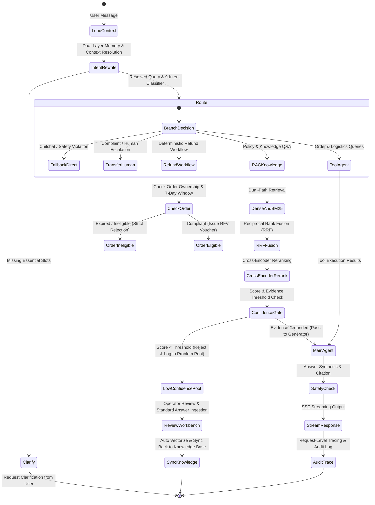

# SureDesk - E-Commerce AI Customer Service System Feature Specification (Spec)

> English | [简体中文](#suredesk-定策---电商-ai-智能客服系统功能规格说明书)

## 1. Goal and Scope

### 1.1 Business Objective
Build a production-grade enterprise e-commerce AI customer service system with deterministic business rule constraints, high-precision hybrid retrieval, zero-trust IDOR security, dual-layer conversation memory, pre-generation confidence gating, and a self-iterating data flywheel loop.

### 1.2 Core Personas
- **End Buyer (User)**: Interacts via conversational web UI for natural language inquiries, order/logistics queries, and returns/refunds with real-time SSE streaming.
- **Operator / Reviewer**: Manages the review workbench to inspect low-confidence queries, deduplicate/merge, supply verified answers, and sync updates directly into the vector knowledge base.
- **DevOps / Engineer**: Inspects request-level tracing, token consumption, node latency, and evidence snapshots.

---

## 2. Functional Requirements

- **R1 (Authentication & Access Control)**: Enforces `SecurityContext(user_id, session_id)`. All order and logistics queries strictly validate user ownership, eliminating Insecure Direct Object Reference (IDOR) vulnerabilities.
- **R2 (Query Rewriting & Intent Disambiguation)**: Performs pronoun resolution on multi-turn context (e.g., "Can it be returned?"), producing semantically complete standalone queries. Classifies inquiries into 9 fine-grained intents.
- **R3 (Five Convergent Execution Routes)**:
  1. Direct Fallback (Chitchat, sensitive content violation)
  2. Human Escalation (Customer complaints, urgent service ticket creation)
  3. Information Clarification (Missing critical slot entities)
  4. Deterministic Workflow (Rule-enforced return and refund operations)
  5. Main Agent / RAG (Policy QA and business tool calling)
- **R4 (Hybrid Retrieval RAG & Reranking)**:
  - Hierarchical Markdown chunking with header trail inheritance and table boundary protection;
  - Dual-path recall with Dense vector embeddings and BM25Okapi sparse keywords;
  - Reciprocal Rank Fusion (RRF, k=60) combining candidate ranks;
  - Cross-Encoder deep semantic reranking for top-K selection;
  - Automated benchmark evaluator calculating Recall@5 and MRR metrics.
- **R5 (Pre-Generation Confidence Gate)**: Evaluates evidence sufficiency before generation.
  - Sufficient evidence: Passes to generator with grounded source citations;
  - Insufficient evidence: Intercepts with a polite standard refusal, sending the query to the data flywheel to prevent hallucinations.
- **R6 (Dual-Layer Conversation Memory)**:
  - Near-term window: Preserves exact message turns;
  - Far-term history: Automatically condenses older turns into structured entity summaries, strictly bounding token consumption without losing critical identifiers.
- **R7 (Function Calling & Tool Registry with MCP)**:
  - Built-in tools for orders, shipments, and inventory;
  - Model Context Protocol (MCP) external tool integration;
  - Pydantic schema validation, execution timeout guards, and security audit logs.
- **R8 (LangGraph Orchestration & State Machine)**:
  - Workflow (deterministic skeleton) + Agent (open ReAct) hybrid architecture;
  - Session state persistence, supporting Human-in-the-loop interruption and resumption.
- **R9 (Streaming Response & Frontend UI)**: FastAPI SSE endpoint providing typewriter streaming; modern responsive buyer chat UI.
- **R10 (End-to-End Tracing & Observability)**: Captures Trace IDs, stage durations, token counts, and evidence snapshots.
- **R11 (Data Flywheel & Operator Workbench)**:
  - 3 ingestion triggers: Confidence gate rejection, self-evaluation failure, and user negative feedback;
  - Bigram Jaccard similarity deduplication and frequency aggregation;
  - Operator workbench for review, verified answer ingestion, and 1-click knowledge base synchronization.
- **R12 (Offline Intent Classification & Fine-Tuning Pipeline)**: Standalone dataset preprocessing, feature extraction, linear model training, and confusion matrix evaluation.

---

## 3. State Machine & Pipeline

---

## 4. Acceptance Criteria

1. **Intent Rewrite Accuracy**: Multi-turn pronoun resolution accuracy >= 95%.
2. **IDOR Interception Rate**: Cross-user unauthorized query attempts 100% blocked with audit log.
3. **Retrieval Quality**: Hybrid retrieval with RRF + Rerank outperforms single-path retrieval.
4. **Confidence Gate Defense**: Queries outside knowledge base 100% trigger graceful rejection and ingestion into problem pool.
5. **Refund Rule Defense**: Orders exceeding 7 days strictly rejected by deterministic state machine.
6. **Data Flywheel Loop**: Adopting an answer in the operator workbench immediately enables the system to correctly answer re-queries.

---
---

# SureDesk (定策) - 电商 AI 智能客服系统功能规格说明书

## 1. 目标与范围 (Goal and Scope)

### 1.1 业务目标
构建一个具备业务确定性约束、高准确率检索、安全可控工具调用、双层会话记忆、置信度拒答与数据自迭代闭环的生产级电商 AI 智能客服系统。

### 1.2 核心用户角色
- **终端买家（User）**：通过 Web 页面进行自然语言多轮问答、订单/物流查询、退换货申请，获得流式（SSE）响应。
- **运营/审核员（Operator）**：在后台工作台审核低置信度问题、查重合并、修正答案并一键回流知识库。
- **运维/工程师（Engineer）**：查看链路追踪（Trace Tree）、Token 消耗、各节点耗时、检索命中证据。

---

## 2. 功能需求列表 (Requirements)

- **R1（接入与鉴权隔离）**：支持传入 `user_id` 与 `session_id`。所有订单、退款、物流查询必须强校验 `user_id` 归属，杜绝越权查询（IDOR）。
- **R2（指代消解与意图识别 Query 改写）**：对多轮半截话结合前序上下文进行指代消解和补全，输出独立语义完整的问题；识别 9 类细分意图。
- **R3（路由与五大分流出口）**：将 9 类意图收敛到 5 个执行出口：直接兜底、转人工/建单、业务信息追问、确定性退款工作流、主力 RAG Agent。
- **R4（全链路混合检索 RAG 与重排）**：文档按层级标题与表格规则切分；稠密向量与 BM25 双路召回；RRF 倒数排名融合；Cross-Encoder 精排；自动化评测脚本计算 Recall@5 与 MRR。
- **R5（置信度闸门与前置防御）**：在生成前进行阈值判断：充分则放行并附带引用；不足则优雅拒答并自动进池，防止幻觉乱承诺。
- **R6（双层会话上下文管理）**：近端保留原始精确消息；远端由后台自动压缩为结构化摘要，严格控制 Token 且不丢关键实体。
- **R7（Function Calling 与工具系统）**：订单、物流、商品工具；支持标准 MCP 协议；参数强校验、超时重试与执行审计日志。
- **R8（LangGraph 编排与确定性状态机）**：Workflow + Agent 混合架构；状态持久化与中断恢复（Human-in-the-loop）。
- **R9（流式响应与前端交互）**：FastAPI SSE 逐字流式打字输出；现代化买家对话 Web 页面。
- **R10（全链路可观测性 Tracing）**：记录请求级 Trace ID、各阶段耗时、Token 用量与证据快照。
- **R11（数据飞轮与运营工作台）**：三入口进池（闸门拦截、自评未过、用户点踩）；文本相似度查重与频次合并；运营后台审核补录标准答案并一键回流。
- **R12（轻量主题分类模型 / 微调评估链路）**：提供离线轻量文本分类器训练、验证、评估独立管线。

---

## 3. 验收标准 (Acceptance Criteria)

1. **意图改写成功率**：多轮半截话指代补全准确率 ≥ 95%。
2. **越权拦截率**：伪造其他用户 `order_id` 查询，100% 拒绝并记录审计。
3. **检索质量评估**：自建评测集在混合检索 + 重排下，Recall@5 与 MRR 明显高于单向量召回。
4. **置信度闸门有效性**：知识库未录入问题，100% 触发优雅拒答并入库问题池，不得编造假政策。
5. **退款规则防御**：超期订单申请退款由确定性 Workflow 准确拦截，Agent 不得擅自承诺退款。
6. **数据飞轮闭环**：在后台为问题池中的未决问题补录答案后，再次提问该问题能正常命中并准确回答。
